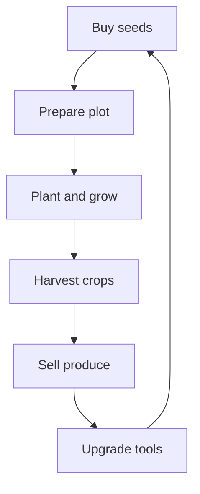
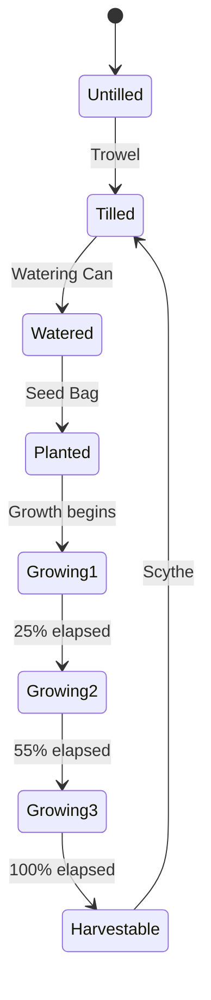
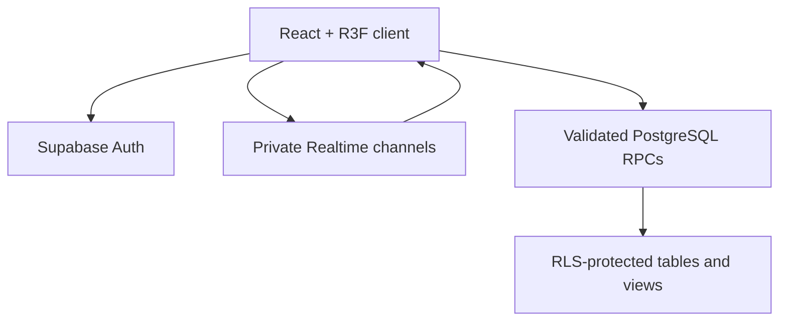

# Project Verdant

## Product Requirements Document: 3D Multiplayer Farming Simulator

| Document field | Value |
|---|---|
| Version | 1.0 |
| Status | Implementation-ready |
| Date | 2026-09-01 |
| Product type | Browser-based 3D multiplayer farming simulator |
| Initial room size | 1–4 authenticated players |
| Primary platforms | Desktop web and mobile web |
| Working title | Project Verdant |

> **Product identity:** Project Verdant may draw genre inspiration from accessible social gardening games, but its name, art, characters, map, UI, audio, crop designs, copy, progression, and economy must be original. No third-party assets, maps, logos, or distinctive branded elements may be copied.

---

## 1. Executive Summary

Project Verdant is a cozy, low-poly 3D farming game that runs directly in modern browsers. Players create a username-only account, enter a shared world with up to three other players, cultivate a persistent 8×8 garden, walk to a physical market to trade, react to global weather, hunt for rare crop mutations, and compete on a world leaderboard.

The product is designed around a short, satisfying loop:

1. Buy seeds at the Market.
2. Prepare, water, and plant soil.
3. Continue playing or leave while crops mature using server time.
4. Return and harvest crops, including rare Gold, Giant, and Rainbow mutations.
5. Sell produce, upgrade tools, and grow wealth.
6. See other players farming in the same room and compare progress on the global monument.

The initial release must feel polished rather than oversized. It includes the complete four-player farming loop, all four weather types, six crops, three mutation classes, tool upgrades, a physical shop, a Top 10 monument, desktop controls, mobile joystick controls, persistence, reconnect recovery, and performance safeguards. Trading, chat, guilds, plot expansion, cosmetics, and dedicated authoritative game servers are reserved for later releases.

The browser client is built with React, TypeScript, Vite, React Three Fiber, Drei, and Zustand. Supabase supplies authentication, PostgreSQL persistence, atomic game transactions, private Realtime Presence and Broadcast channels, and leaderboard queries. PostgreSQL functions—not client state—are authoritative for balances, inventory, tool upgrades, crop rewards, mutation rolls, and room-slot assignment.

---

## 2. Product Vision

### 2.1 Vision statement

Create the fastest path from “open a link” to “I grew something valuable with friends” in a beautiful, responsive 3D farming world.

### 2.2 Player promise

Within two minutes of opening the game, a new player can create an account, enter a shared garden, plant a crop, see another player moving smoothly, and understand how to earn their next upgrade.

### 2.3 Target audience

- Primary: players aged 10+ who enjoy cozy progression, collecting, idle growth, and light social presence.
- Secondary: mobile-first players who want a low-friction game without an installation.
- Tertiary: completion-focused players motivated by rare mutations and leaderboard rank.

### 2.4 Design pillars

| Pillar | Product implication |
|---|---|
| Immediate satisfaction | Basic actions respond instantly and give clear visual, audio, and haptic feedback. |
| Cozy social presence | Other players make the world feel alive without chat, PvP, griefing, or forced cooperation. |
| Meaningful rarity | Mutations are uncommon, visually unmistakable, and economically valuable. |
| Walkable world | Market and leaderboard interactions happen at physical landmarks, not only through menus. |
| Persistent progress | Crops, inventory, tools, and balance survive refreshes, reconnects, and new rooms. |
| Smooth everywhere | The game maintains stable frame pacing on desktop and mid-range mobile hardware. |

---

## 3. Goals, Non-Goals, and Constraints

### 3.1 Release goals

1. Deliver a complete farm-to-market progression loop for 1–4 players.
2. Make account creation possible with only a username and password.
3. Persist player economy and plot state safely in Supabase.
4. Synchronize remote movement smoothly at a maximum outbound rate of 20 updates per second.
5. Load or update all four plots without creating runtime shaders, materials, or React mesh trees.
6. Support keyboard/mouse and touch/virtual-joystick play at launch.
7. Prevent ordinary clients from directly writing balances, rewards, mutation outcomes, or another user’s farm.
8. Ship with measurable performance, reliability, and test thresholds.

### 3.2 Explicit non-goals for V1

- Text, voice, or proximity chat.
- Player-to-player trading, gifting, stealing, or plot editing.
- PvP, combat, crop destruction, or crop death.
- Guilds, parties, friend lists, private room codes, or invitations.
- More than four simultaneous players in one room.
- Dedicated authoritative movement/physics servers.
- Offline farming actions. Time-based crop maturation continues while the player is away, but planting, buying, selling, and harvesting require connectivity.
- User-generated content, custom names for crops, or custom image uploads.
- Plot expansion beyond 8×8.
- Email-based verification or password reset.
- Native iOS or Android applications.

### 3.3 Binding assumptions

- The V1 world is non-combat and cooperative-by-presence; players cannot alter another player’s plot.
- One persistent plot belongs to each account. Its visual location changes to the user’s assigned room slot.
- Weather is global, so every active room experiences the same weather epoch.
- The initial game supports six crop types and three tool-upgrade levels.
- Username changes are not supported in V1.
- Because synthetic internal emails cannot receive messages, forgotten-password recovery is not self-service. Registration must clearly warn the player to store their password. A recovery-code system is a post-launch priority.
- Supabase email confirmation must be disabled for this project because `${username}@game.internal` is intentionally non-deliverable.

---

## 4. Success Metrics

The following are launch targets, measured after excluding known bots, internal testers, and unsupported browsers.

| Area | Metric | Launch target |
|---|---|---|
| Activation | New accounts that plant a first crop | ≥ 75% |
| Activation speed | Median time from successful sign-up to first planting | ≤ 120 seconds |
| Engagement | Median completed session | ≥ 15 minutes |
| Retention | Day-1 returning players | ≥ 25% |
| Reliability | Crash-free sessions | ≥ 99.5% |
| Authentication | Successful valid login attempts | ≥ 98% |
| Matchmaking | Median room join time | ≤ 2 seconds |
| Matchmaking | P95 room join time | ≤ 5 seconds |
| Persistence | Confirmed economy actions lost | 0 |
| Networking | P95 remote-player visual correction | < 0.75 meters under a stable 100 ms connection |
| Desktop performance | Median frame rate on target hardware | ≥ 55 FPS |
| Mobile performance | Median frame rate on target hardware | ≥ 40 FPS, never sustained below 30 FPS |
| Leaderboard | Successful scheduled refreshes | ≥ 99% |

---

## 5. Release Scope and Priorities

### 5.1 P0: required for public launch

- Username/password registration, login, logout, session restoration, and accessible password visibility control.
- Four-player atomic matchmaking and unique slot assignment.
- Low-poly world, four plots, Market, leaderboard monument, collisions, camera, desktop controls, and mobile controls.
- Presence join/leave state and Broadcast movement synchronization.
- Complete soil-to-harvest state machine.
- Six crops, inventory, balance, seed purchasing, crop selling, and three tool levels.
- Sun, Rain, Heatwave, and Blood Moon weather.
- Gold, Giant, and Rainbow mutations.
- Persistent plots and server-authoritative economy transactions.
- Global Top 10 leaderboard.
- Reconnect, stale-state recovery, loading states, empty states, and actionable errors.
- Instanced rendering, shader prewarming, adaptive quality, and performance instrumentation.
- RLS, private Realtime authorization, schema constraints, idempotency, and concurrency tests.

### 5.2 P1: first post-launch update

- One-time recovery codes for password recovery.
- Private room codes and friend joining.
- Cosmetic character and plot themes.
- Daily tasks and non-pay-to-win achievements.
- Additional crops and weather-reactive world events.
- Player emotes using a small curated set.

### 5.3 P2: future expansion

- Expandable plots.
- Seasonal content and limited collections.
- Social groups or guild gardens.
- Player trading after fraud, moderation, and economy-sink systems exist.
- Dedicated authoritative simulation if competitive features or meaningful monetization require stronger movement validation.

---

## 6. Core Player Journey

### 6.1 First session

1. The loading screen initializes assets, compiles materials, connects to Supabase, and displays progress.
2. The player sees the auth modal with Register and Login tabs.
3. Registration validates username and password locally, then repeats all validation on the server.
4. The new-account database trigger creates the profile, wallet, plot, 64 tile records, starter inventory, and tool levels atomically.
5. Matchmaking assigns the player to an open room and one of slots 0–3.
6. The player spawns beside their garden. A 45-second contextual tutorial highlights the toolbelt and first tile.
7. The player tills, waters, plants, and sees a visible growth timer.
8. The tutorial points toward the Market and explains buying and selling.
9. The leaderboard monument becomes interactable after the player completes one harvest.

### 6.2 Returning session

1. Supabase restores the persisted session.
2. The app fetches profile, inventory, tool levels, current weather, and matchmaking state in parallel.
3. The player joins a room, then receives one authoritative room snapshot.
4. Crop stages are reconstructed from server timestamps; no per-crop timers need to have run while the client was closed.
5. The game shows a concise “While you were away” summary for newly harvestable crops.

### 6.3 Core loop



---

## 7. Functional Requirements

### 7.1 Authentication and account lifecycle

| ID | Requirement |
|---|---|
| AUTH-01 | The auth modal must provide Login and Register modes without navigating away from the game shell. |
| AUTH-02 | Username input is trimmed and must match `^[A-Za-z0-9]{3,16}$`. Spaces, punctuation, Unicode confusables, and more than 16 characters are rejected. |
| AUTH-03 | The canonical username is `username.toLowerCase().trim()`. Display capitalization may be preserved in `profiles.username_display`; uniqueness is case-insensitive. |
| AUTH-04 | The internal email must be `${canonicalUsername}@game.internal` and must never be displayed as the player’s email. |
| AUTH-05 | Registration calls `signUp` with `options.data.username` so the validated value enters `raw_user_meta_data` and the account trigger can create game records. |
| AUTH-06 | Passwords must contain 8–72 characters. The UI includes an accessible Show/Hide Password button and a Caps Lock warning. |
| AUTH-07 | The submit button is disabled while a request is active, and repeated submissions cannot create duplicate calls. |
| AUTH-08 | Duplicate usernames return “That username is already taken” without revealing any other account information. Invalid login returns one generic error. |
| AUTH-09 | Supabase session persistence and refresh are enabled. App state listens to auth-state changes and restores the profile on reload. |
| AUTH-10 | Registration displays a clear warning that password recovery is unavailable in V1 because no real email is collected. |
| AUTH-11 | The server trigger revalidates the username. Security decisions must never read mutable `raw_user_meta_data` after account creation. |
| AUTH-12 | Login and registration forms use `autocomplete="username"`, `autocomplete="current-password"`, and `autocomplete="new-password"` appropriately. |

### 7.2 Onboarding

| ID | Requirement |
|---|---|
| ONB-01 | New players receive 100 coins, five Carrot seeds, and level-one versions of all four tools. |
| ONB-02 | Tutorial prompts are contextual, dismissible, and never block movement. |
| ONB-03 | The first tutorial covers movement, camera, one complete planting sequence, the Market, and harvesting. |
| ONB-04 | Tutorial completion is stored per profile and does not restart on another device. |
| ONB-05 | Returning players can replay controls and farming instructions from Settings. |

### 7.3 World layout

The V1 map is a compact 64×64-meter floating garden island centered on a social plaza.

| Landmark | World position | Purpose |
|---|---:|---|
| Central spawn plaza | `(0, 0, 0)` | Safe spawn and orientation point |
| Market | `(0, 0, -25)` | Buy seeds, sell produce, upgrade tools |
| Leaderboard monument | `(0, 0, 25)` | Display global Top 10 balance ranking |
| Plot slot 0 | `(-18, 0, -11)` | Northwest persistent-player plot |
| Plot slot 1 | `(18, 0, -11)` | Northeast persistent-player plot |
| Plot slot 2 | `(-18, 0, 11)` | Southwest persistent-player plot |
| Plot slot 3 | `(18, 0, 11)` | Southeast persistent-player plot |

World requirements:

- Each plot contains an 8×8 grid of one-meter soil tiles.
- Paths make every landmark reachable without crossing a plot.
- A low fence, color banner, floating username plate, and slot number communicate plot ownership.
- Players cannot enter Market UI unless within a three-meter interaction radius.
- The leaderboard is directly opposite the Market and visually recognizable from the central plaza.
- Invisible boundary colliders prevent leaving the island. Collision geometry must be simpler than visual geometry.
- Spawn positions must not overlap other players or interaction triggers.

### 7.4 Player, camera, and controls

#### Desktop

| Action | Default input |
|---|---|
| Move | WASD or arrow keys |
| Sprint | Shift |
| Interact | E or primary click when prompted |
| Select tools | 1–4 or toolbelt click |
| Use selected tool | Primary click |
| Rotate camera | Right-drag or middle-drag |
| Zoom | Mouse wheel |
| Menu / close modal | Escape |

#### Mobile

- Landscape is recommended, but portrait remains playable.
- A floating left-side virtual joystick controls movement with an adjustable dead zone.
- A right-side Action button performs the current contextual action.
- A bottom toolbelt selects Trowel, Watering Can, Seed Bag, or Scythe.
- Dragging an unused screen area rotates the camera; pinch changes zoom.
- Controls respect safe-area insets and never overlap shop or auth input fields.
- Touch targets are at least 44×44 CSS pixels.
- Optional haptic feedback fires on successful tool use, purchase, sale, harvest, and rare mutation reveal when supported.

#### Movement and camera behavior

- The local player moves using client-side acceleration and deceleration, not instantaneous velocity changes.
- Character facing follows movement direction unless the player is stationary.
- The third-person camera uses a three-quarter elevated angle, soft follow, obstacle avoidance, bounded zoom, and optional reduced motion.
- Movement must be disabled while a blocking modal owns keyboard focus.
- The player animation state is one of `idle`, `walk`, `run`, or `use_tool`.

### 7.5 Toolbelt and interaction model

| Tool | Valid target | Primary action |
|---|---|---|
| Trowel | Untilled tile | Convert to Tilled |
| Watering Can | Tilled tile | Convert to Watered |
| Seed Bag | Watered tile | Consume selected seed and Plant |
| Scythe | Harvestable tile | Harvest produce and reset tile to Tilled |

- A ground reticle must show the targeted tile and change color for valid, invalid, pending, and other-player-owned states.
- Selecting Seed Bag opens a compact seed picker populated from owned, unlocked seed stacks; the last valid selection persists across sessions.
- The client may animate optimistically, but the tile remains “pending” until the server accepts the action.
- Rejected actions roll back to the last authoritative state and show a short reason.
- Holding or dragging a tool across tiles may queue actions, but the client must respect tool level, cooldown, ownership, inventory, and a maximum request batch of nine tiles.
- Players cannot interact with another user’s tiles.

### 7.6 Farming state machine



Rules:

- `Planted` is a persisted logical state; visual stage 1 appears immediately.
- Growth stages are derived from `planted_at`, `ready_at`, and current server time. The database does not write a row at every visual stage.
- Stage boundaries are 0–25%, 25–55%, 55–85%, and 85–100% of effective growth time. The final interval visually signals near-readiness; the tile becomes actionable only at 100%.
- Crops cannot wither, die, or be stolen in V1.
- Harvesting resets the tile to Tilled, not Untilled, so the next loop requires watering but not tilling.
- Each mutation is rolled exactly once inside the successful harvest transaction and stored with the produced inventory.
- Growth and harvest checks use PostgreSQL server time. Device-clock changes cannot mature crops.

### 7.7 Crop catalog and initial economy

All currency values are integers. The following values are binding launch defaults and may later be changed through versioned server-side catalog data.

| Crop | Seed cost | Base growth | Yield | Base sale per item | Normal gross value | Unlock |
|---|---:|---:|---:|---:|---:|---|
| Carrot | 10 | 45 sec | 1 | 16 | 16 | Starter |
| Strawberry | 30 | 90 sec | 2 | 20 | 40 | Starter |
| Tomato | 70 | 180 sec | 3 | 32 | 96 | 250 lifetime coins |
| Corn | 160 | 300 sec | 3 | 70 | 210 | 1,000 lifetime coins |
| Pumpkin | 400 | 480 sec | 1 | 600 | 600 | 3,000 lifetime coins |
| Sunflower | 900 | 720 sec | 2 | 600 | 1,200 | 10,000 lifetime coins |

- Unlock requirements use lifetime earned coins, not current balance, so spending cannot relock content.
- Seed purchases and produce sales are atomic and return the new balance and inventory quantities.
- Currency cannot become negative and inventory quantities cannot fall below zero.
- Every economy mutation writes an immutable transaction ledger entry.
- There are no paid currencies or real-money purchases in V1.

### 7.8 Tool upgrades

| Level | Area pattern | Action cooldown | Cost per tool |
|---|---|---:|---:|
| 1 | One tile | 650 ms | Starter |
| 2 | Three-tile line centered on target | 450 ms | 750 coins |
| 3 | 3×3 area centered on target | 300 ms | 3,500 coins |

- Each tool upgrades independently.
- An area action affects only valid owned tiles and consumes only the required seeds.
- The server validates that the submitted tile set is legal for the player’s tool level.
- Upgrades are permanent, idempotent, and cannot be sold.

### 7.9 Weather engine

Weather is global and advances in server-controlled five-minute epochs.

| Weather | Selection weight | Growth duration at planting | Primary audiovisual treatment |
|---|---:|---:|---|
| Sun | 45% | 100% | Warm directional light, soft breeze |
| Rain | 30% | 85% | Rain particles, wet ground, cooler light |
| Heatwave | 17% | 70% | Heat shimmer, amber light, dry wind |
| Blood Moon | 8% | 90% | Red moonlight, dark sky, rare ambient cue |

Rules:

- The same weather cannot occur more than twice consecutively.
- A five-second transition crossfades lighting, sky, fog, ambience, particles, and UI indicator.
- Weather at planting determines `ready_at`; later weather changes do not rewrite that crop’s growth time.
- Weather at harvest determines mutation probabilities. Waiting for a favorable weather window is intended strategy.
- Weather changes never destroy crops or remove progress.
- Mobile low-quality mode reduces particle count and disables heat distortion while preserving gameplay state.
- A server scheduler advances weather and publishes a single authoritative weather-change event. Clients also poll the world-state row at each epoch boundary to recover from missed events.

### 7.10 Mutation system

Mutation results are mutually exclusive and rolled server-side during harvest.

| Harvest weather | Gold chance | Giant chance | Rainbow chance | Normal chance |
|---|---:|---:|---:|---:|
| Sun | 4.00% | 2.00% | 0.25% | 93.75% |
| Rain | 1.00% | 6.00% | 0.25% | 92.75% |
| Heatwave | 7.00% | 1.00% | 0.50% | 91.50% |
| Blood Moon | 5.00% | 3.00% | 4.00% | 88.00% |

| Mutation | Sale multiplier | Visual treatment |
|---|---:|---|
| Normal | ×1 | Standard crop palette and scale |
| Gold | ×5 | Gold instance color, metallic sparkle cue |
| Giant | ×3 | 1.6× instance scale, heavier harvest effect |
| Rainbow | ×15 | Animated palette cycle and unique reveal effect |

- All items from one harvested tile receive the same mutation.
- The mutation multiplier applies to base sale value and is stored with the inventory stack.
- The server locks the tile row during harvest, checks readiness, rolls once, changes state once, grants inventory once, and records the result once.
- Repeated requests using the same idempotency key return the original result.
- Reveal animation must not delay the durable transaction or allow rerolls.

### 7.11 Physical Market and shop UI

| ID | Requirement |
|---|---|
| SHOP-01 | A prompt appears when the local player enters the Market’s three-meter interaction radius. |
| SHOP-02 | Pressing E, clicking the prompt, or tapping Action opens the Market UI. |
| SHOP-03 | The Market contains Seeds, Sell, and Tools tabs. |
| SHOP-04 | Seed cards show price, owned quantity, growth time, yield, base value, and unlock condition. |
| SHOP-05 | Sell supports individual stacks and Sell All, with a confirmation for totals above 5,000 coins. |
| SHOP-06 | Tool cards show current level, next area pattern, cooldown, and cost. |
| SHOP-07 | Every purchase, sale, or upgrade calls one atomic RPC and remains disabled until success, known rejection, or timeout. |
| SHOP-08 | Closing the UI returns focus to movement controls and does not move the player. |
| SHOP-09 | Leaving the radius automatically closes the Market after a one-second grace period. |

The client-side proximity rule is a product interaction requirement, not a strong anti-cheat boundary. Without an authoritative movement server, a modified client could invoke an otherwise valid shop RPC remotely. Server functions must still enforce prices, ownership, inventory, unlocks, and balances so proximity bypass cannot create currency or items.

### 7.12 Global leaderboard monument

- The monument displays positions 1–10 from `public.top_10_leaderboard`.
- Each row shows rank, display username, and current balance.
- Results order by `balance DESC`, then `balance_updated_at ASC`, then canonical username.
- The client requests the leaderboard on world entry, when the monument opens, and every 60 seconds while the game is visible.
- A subtle “Updated N seconds ago” label communicates freshness.
- The 3D surface uses a pre-created canvas texture updated in place; it must not create a new material on every poll.
- An accessible HTML panel mirrors the monument contents when focused or tapped.
- Internal test profiles can be excluded using `profiles.is_ranked = false`.
- Failed refreshes keep the last successful data, show a stale indicator, and retry with exponential backoff.

### 7.13 Multiplayer room behavior

- Matchmaking places a player in the oldest healthy open room with fewer than four active leases; otherwise it creates a room.
- Slots are integers 0–3 and are unique within an active room.
- Room allocation occurs inside one PostgreSQL transaction using row locking and uniqueness constraints. Presence is used for liveness display, not as the allocator.
- A player renews their room lease every 10 seconds. A lease is stale after 30 seconds.
- A disconnected player has a 45-second reclaim grace period. Reconnecting during the grace period recovers the same room and slot when possible.
- A fifth player is assigned to another open room or a new room.
- When every member leaves and all leases expire, a room becomes closed and is eligible for cleanup.
- Another player’s plot is visible and updates in real time, but is never interactable.
- There is no host. Room behavior must continue when the earliest participant disconnects.

### 7.14 Movement synchronization

- The local client simulates and renders its player every animation frame.
- While moving, it broadcasts at a 20 Hz target and never exceeds the configured 20 outbound events per second. While idle, it sends a 2 Hz keepalive plus immediate animation-state changes.
- Each packet contains protocol version, room ID, user ID, monotonically increasing sequence, client timestamp, position `(x,y,z)`, yaw, velocity magnitude, and animation state.
- Application payload size must remain below 256 bytes before transport framing.
- Receivers reject packets from non-members, wrong rooms, unknown protocol versions, stale sequences, non-finite values, impossible map bounds, or implausible speed deltas.
- Remote clients render approximately 100 milliseconds behind the newest received state and use linear interpolation (`lerp`) between buffered snapshots.
- Extrapolation is allowed for at most 250 milliseconds. After that, the character eases to idle until new state arrives.
- Corrections below 1.5 meters are eased over 100 milliseconds. Larger corrections snap with a short fade to avoid crossing the map visibly.
- Movement Broadcast is ephemeral and never used to calculate currency, crops, inventory, or leaderboard position.

### 7.15 Plot synchronization and zero-stutter loading

- World boot allocates all soil, crop, shadow, and selection instance capacity before gameplay begins.
- A room snapshot returns all occupied plots in one response with plot versions and server time.
- Plot rows are decoded off the main render path into typed arrays. A Web Worker is preferred; `requestIdleCallback` with a bounded fallback is acceptable when Workers are unavailable.
- The worker transfers compact state arrays to the main thread, which updates matrices, colors, and visible instance counts directly through refs.
- React components must not be created per tile or per crop.
- Authoritative farm RPCs emit compact plot-patch events containing owner ID, plot version, and changed tile records.
- A version gap causes a single snapshot refresh for that plot. Events are not blindly replayed across missing versions.
- Shader programs and materials are compiled during loading. Runtime joins may not introduce an unseen material or shader variant.

### 7.16 Persistence and autosave

- Economy-changing actions are persisted immediately through atomic RPCs; they never wait for the 15-second autosave interval.
- Farming actions are persisted on server acceptance. The client maintains a local operation queue only for retry and visual pending state.
- Every 15 seconds while visible, the client sends a lightweight checkpoint containing the last acknowledged plot version, room lease, and unsent idempotent operations.
- `visibilitychange` and `pagehide` trigger a best-effort final checkpoint using a keepalive-capable request. Correctness must not depend on `beforeunload`, which is not guaranteed on mobile or abrupt termination.
- On resume, the client compares authoritative versions and refreshes only divergent state.
- Crops mature from server timestamps even when no browser is connected.
- If connectivity is lost, movement may continue locally, but Market and farm mutations enter a disabled/pending state after three seconds. The UI explains that connection is required.

---

## 8. Technical Architecture

### 8.1 Recommended stack

| Layer | Technology | Responsibility |
|---|---|---|
| Build and UI | React + TypeScript + Vite | Application shell, HUD, modals, routing, code splitting |
| 3D rendering | Three.js via React Three Fiber + Drei | World, characters, camera, lighting, instanced farming |
| Client state | Zustand | Auth projection, session UI, inventory cache, tool selection, network state |
| Durable backend | Supabase PostgreSQL | Profiles, plots, economy, catalogs, rooms, weather, transactions |
| Authentication | Supabase Auth | Username-mapped email/password sessions |
| Realtime | Supabase Presence + Broadcast | Room liveness, movement, authoritative patch fan-out |
| Trusted mutations | PostgreSQL RPC functions | Farm actions, purchases, sales, upgrades, matchmaking, harvest rolls |
| Background work | Supabase Cron / scheduled database function | Weather epochs and stale-room cleanup |
| Testing | Vitest, React Testing Library, Playwright, pgTAP | Client, end-to-end, database, RLS, and concurrency coverage |

### 8.2 System boundaries



The client is authoritative only for local presentation and temporary movement. PostgreSQL is authoritative for anything that affects persistent progression or global ranking.

### 8.3 Suggested source structure

```text
src/
  app/
    App.tsx
    routes.tsx
    providers/
  components/
    ui/
  features/
    auth/
    onboarding/
    market/
    leaderboard/
    settings/
  game/
    GameCanvas.tsx
    world/
    player/
    farming/
    weather/
    multiplayer/
    interaction/
    performance/
  lib/
    supabase/
    validation/
    telemetry/
  stores/
  workers/
    plotDecode.worker.ts
  types/
supabase/
  migrations/
  seed.sql
  tests/
```

Module boundaries:

- `features/*` owns HTML UI and product workflows.
- `game/*` owns render-loop and spatial systems.
- `lib/supabase` owns the only Supabase client and typed data gateway.
- Zustand stores hold serializable application state, not Three.js objects.
- High-frequency transforms live in refs, typed arrays, or dedicated simulation objects outside React state.
- Generated database types are committed and regenerated after every migration.

### 8.4 Environment and Supabase client

Required Vite environment variables:

```dotenv
VITE_SUPABASE_URL=https://seagnmdgauxhqwvmveij.supabase.co
VITE_SUPABASE_PUBLISHABLE_KEY=sb_publishable_N2fFvs8IEwxDyK0pysbOcw_Q_r3Yo5Y
```

Required client contract:

```ts
import { createClient } from '@supabase/supabase-js'

export const supabase = createClient(
  import.meta.env.VITE_SUPABASE_URL,
  import.meta.env.VITE_SUPABASE_PUBLISHABLE_KEY,
  {
    auth: {
      persistSession: true,
      autoRefreshToken: true,
      detectSessionInUrl: false,
    },
    realtime: {
      params: {
        eventsPerSecond: 20,
      },
    },
  },
)
```

Configuration rules:

- The publishable key may ship in the browser. It grants no trusted authority by itself; RLS, grants, and RPC validation are mandatory.
- A `service_role` key must never appear in source, browser storage, build output, logs, or `VITE_*` variables.
- Environment validation must fail fast with a human-readable setup error when either variable is missing.
- The exact installed `@supabase/supabase-js` version is pinned in the lockfile and the Realtime configuration is covered by an integration smoke test.

---

## 9. Supabase Data Model

### 9.1 Tables

| Table | Key fields | Purpose |
|---|---|---|
| `profiles` | `id`, `username_canonical`, `username_display`, `balance`, `lifetime_earned`, `balance_updated_at`, `tutorial_complete`, `is_ranked` | Public game identity and progression summary |
| `plots` | `id`, `owner_id`, `grid_size`, `version`, `updated_at` | One persistent plot per account |
| `plot_tiles` | `plot_id`, `tile_index`, `state`, `crop_id`, `planted_at`, `ready_at`, `mutation`, `version` | Sixty-four authoritative tile records per plot |
| `inventory_items` | `owner_id`, `item_kind`, `item_id`, `mutation`, `quantity` | Seed and harvested produce quantities |
| `player_tools` | `owner_id`, `tool_id`, `level`, `updated_at` | Permanent independent tool levels |
| `crop_catalog` | `crop_id`, prices, timing, yield, unlock, `catalog_version`, `enabled` | Server-authoritative crop tuning |
| `tool_catalog` | `tool_id`, level, cost, area, cooldown, `catalog_version` | Server-authoritative tool tuning |
| `game_rooms` | `id`, `status`, `capacity`, `created_at`, `last_activity_at` | Room allocation state |
| `room_members` | `room_id`, `user_id`, `slot`, `lease_expires_at`, `reclaim_until`, `joined_at` | Atomic room membership and slot leases |
| `world_state` | singleton ID, `weather`, `epoch`, `starts_at`, `ends_at`, `previous_weather` | Current authoritative global weather |
| `economy_transactions` | `id`, `owner_id`, `kind`, `amount`, `balance_after`, `idempotency_key`, `metadata`, `created_at` | Immutable audit ledger |
| `farm_operations` | `id`, `owner_id`, `plot_id`, `kind`, `idempotency_key`, `result`, `created_at` | Retry-safe farm operation record |
| `blocked_usernames` | `normalized_term`, `reason` | Reserved and moderated username patterns |

### 9.2 Required constraints and indexes

- `profiles.id` references `auth.users(id)` with controlled account-deletion behavior.
- `profiles.username_canonical` is unique and lowercase.
- `plots.owner_id` is unique.
- `plot_tiles` primary key is `(plot_id, tile_index)`; `tile_index` is constrained to 0–63 for V1.
- Inventory primary key is `(owner_id, item_kind, item_id, mutation)` and `quantity >= 0`.
- `profiles.balance >= 0` and `profiles.lifetime_earned >= 0`.
- `room_members` has unique `(room_id, slot)` and prevents one user from holding multiple live room leases.
- `economy_transactions` and `farm_operations` each have unique `(owner_id, idempotency_key)`.
- Index `profiles(balance DESC, balance_updated_at ASC)` supports leaderboard queries.
- Indexes on plot owner, live room leases, room status/activity, transaction owner/time, and operation owner/time are required.
- All timestamps use `timestamptz` and are generated by the database.

### 9.3 Account-creation trigger

`handle_new_user()` executes atomically after an Auth user is created:

1. Read and normalize `raw_user_meta_data->>'username'`.
2. Reject missing, malformed, blocked, or duplicate usernames.
3. Create `profiles` with 100 starting coins.
4. Create one 8×8 `plots` record.
5. Create 64 Untilled `plot_tiles` rows using `generate_series(0, 63)`.
6. Add five Carrot seeds.
7. Create level-one records for all four tools.

The function uses a fixed empty `search_path` and schema-qualified table names. Metadata is treated only as untrusted trigger input and is not later used for authorization.

### 9.4 Required RPC functions

| Function | Responsibility |
|---|---|
| `join_or_create_room()` | Atomically select/create room, reserve unique slot, and return room membership |
| `renew_room_lease(room_id)` | Extend only the caller’s valid lease |
| `leave_room(room_id)` | Release the caller’s room lease safely |
| `get_room_snapshot(room_id)` | Return active members, plot versions, compact tile state, and server/world time |
| `farm_till(tile_indices, idempotency_key)` | Validate ownership, level pattern, and tile states; till valid tiles |
| `farm_water(tile_indices, idempotency_key)` | Validate and water Tilled tiles |
| `farm_plant(crop_id, tile_indices, idempotency_key)` | Lock inventory and tiles, consume seeds, set timestamps, increment plot version |
| `farm_harvest(tile_indices, idempotency_key)` | Lock tiles, verify readiness, roll mutation, grant produce, reset tiles, return reveal data |
| `shop_buy_seeds(crop_id, quantity, idempotency_key)` | Validate catalog/unlock/balance and atomically buy |
| `shop_sell_produce(lines, idempotency_key)` | Validate inventory and atomically credit exact proceeds |
| `shop_upgrade_tool(tool_id, idempotency_key)` | Validate next level and price, then debit and upgrade once |
| `get_current_weather()` | Return current epoch and authoritative server time |
| `checkpoint_client(plot_version, pending_keys)` | Reconcile acknowledgments and return divergence instructions |

Every public RPC must derive player identity from `auth.uid()`, validate all parameters, use server catalog values, bound array sizes, return typed error codes, and avoid trusting client-provided prices, rewards, timestamps, mutation values, room slots, or balances.

### 9.5 Leaderboard view

`public.top_10_leaderboard` returns only:

- `rank`
- `profile_id`
- `username_display`
- `balance`
- `balance_updated_at`

It filters `is_ranked = true`, orders deterministically, and limits to 10. The view uses an RLS-compatible security model and exposes no Auth email, metadata, inventory, IP data, or internal moderation fields.

### 9.6 RLS and grants

| Resource | Read policy | Write policy |
|---|---|---|
| `profiles` | Authenticated players may read leaderboard-safe profile fields | Owner may update only explicitly safe preferences; progression fields are RPC-only |
| `plots`, `plot_tiles` | Owner and active room members may read | Direct client writes denied; trusted farm RPCs only |
| `inventory_items`, `player_tools` | Owner only | Direct writes denied; trusted RPCs only |
| `crop_catalog`, `tool_catalog`, `world_state` | Authenticated read | Client writes denied |
| `game_rooms`, `room_members` | Active related members can read required fields | Direct writes denied; matchmaking/lease RPCs only |
| `economy_transactions`, `farm_operations` | Owner may read recent records | Inserts/updates/deletes denied to clients |
| `top_10_leaderboard` | Authenticated read | Not writable |

- RLS is enabled on every exposed table before client integration begins.
- Table grants are minimized in addition to RLS.
- Private Realtime channel access is controlled through policies on `realtime.messages` based on valid, unexpired room membership.
- `SECURITY DEFINER` is used only where required, with `SET search_path = ''`, schema-qualified references, strict argument checks, and restricted execute grants.
- Database security and performance advisors must have no unresolved high-severity findings before launch.

---

## 10. Realtime Protocol

### 10.1 Channel topology

| Topic | Visibility | Purpose |
|---|---|---|
| `room:{room_id}:presence` | Private | Member join, leave, identity, assigned slot, client version |
| `room:{room_id}:movement` | Private | Ephemeral 20 Hz movement and animation Broadcast |
| `room:{room_id}:farm` | Private | Authoritative compact plot-patch Broadcasts |
| `world:weather` | Authenticated | One event when global weather changes |

Dedicated topics prevent unrelated rooms from receiving each other’s traffic.

### 10.2 Presence payload

Presence is updated on subscribe, slot assignment, reconnect, and material profile changes—not during movement.

```ts
type RoomPresence = {
  userId: string
  username: string
  slot: 0 | 1 | 2 | 3
  avatarVariant: number
  clientVersion: string
  joinedAt: string
}
```

Presence is a live UI signal. Database leases remain authoritative during races, disconnects, and reconnects.

### 10.3 Movement payload

```ts
type MovementPacketV1 = {
  v: 1
  roomId: string
  userId: string
  seq: number
  t: number
  p: [number, number, number]
  yaw: number
  speed: number
  anim: 0 | 1 | 2 | 3
}
```

### 10.4 Farm patch payload

```ts
type FarmPatchV1 = {
  v: 1
  ownerId: string
  plotVersion: number
  tiles: Array<{
    i: number
    state: number
    crop: number | null
    plantedAt: number | null
    readyAt: number | null
    mutation: number
  }>
}
```

Patches originate only after committed server transactions. The client uses them for display, then verifies version continuity.

### 10.5 Reconnect sequence

1. Mark connection as degraded after two missed heartbeat intervals.
2. Freeze trusted interactions after three seconds offline; keep camera and local movement responsive.
3. Reconnect with exponential backoff of 1, 2, 4, 8, then 15 seconds with jitter.
4. Refresh the Auth token before rejoining private channels when necessary.
5. Call `join_or_create_room()`; reclaim the old lease if valid.
6. Fetch one room snapshot and current weather.
7. Rebuild remote buffers and plot instance data.
8. Clear degraded state only after snapshot versions and channel subscriptions are current.

---

## 11. Rendering and Performance Design

### 11.1 Instanced farming renderer

- Allocate one soil `InstancedMesh` with capacity for all 256 room tiles. Soil condition is represented with per-instance color/material attributes and matrix changes.
- Allocate crop pools by crop archetype and growth stage: six crops × four visual stages = 24 pre-created `InstancedMesh` objects.
- Mutation visuals use per-instance color, scale, and compact shader attributes. They must not multiply the number of materials.
- Each crop pool is allocated to worst-case room capacity during loading, then uses `.count` to limit visible instances.
- Selection, pending, and invalid overlays use a small preallocated indicator pool.
- Set `instanceMatrix.usage` for dynamic updates and mark only changed buffers dirty.
- Frustum culling uses plot-level bounds rather than recalculating individual crop bounds per frame.

### 11.2 Shader and asset prewarming

- Every material, crop stage, weather variant, and mutation attribute path is compiled during the loading scene.
- Materials are stable singletons and cannot be created inside render loops or player-join handlers.
- A hidden warmup scene or renderer compilation step runs before “Enter World” becomes available.
- Textures use atlases where practical. Mobile uses compressed textures and lower particle counts.
- Asset loading failures fall back to procedural low-poly meshes rather than blocking account access.

### 11.3 Performance budgets

| Budget | Desktop target | Mobile target |
|---|---:|---:|
| Frame rate | 60 FPS target, 55 FPS median minimum | 45 FPS target, 30 FPS sustained minimum |
| Active triangles | ≤ 250,000 | ≤ 120,000 |
| Draw calls | ≤ 100 | ≤ 70 |
| Device pixel ratio | 1.0–2.0 adaptive | 1.0–1.5 adaptive |
| Texture memory | ≤ 250 MB | ≤ 160 MB |
| Initial compressed assets | ≤ 10 MB | ≤ 7 MB |
| Main-thread long task | None > 50 ms during a player/plot join | Same |
| Farm patch application | P95 < 8 ms | P95 < 16 ms |
| Movement app payload | < 256 bytes | < 256 bytes |

### 11.4 Adaptive quality

- Presets: Low, Medium, High, and Auto.
- Auto measures frame time after a 10-second warmup and may reduce shadows, particles, vegetation density, post-processing, and pixel ratio.
- Auto never changes crop visibility, interaction ranges, mutation readability, timers, or gameplay-relevant state.
- A quality change must not recompile new shaders during active gameplay; all supported variants are prewarmed.

---

## 12. State, Consistency, and Error Handling

### 12.1 Consistency model

- Local movement: immediate and client-owned.
- Remote movement: eventually consistent, interpolated, ephemeral.
- Plot visuals: optimistic with authoritative server confirmation and monotonically increasing versions.
- Economy: strongly consistent per transaction using row locks and idempotency keys.
- Leaderboard: eventually consistent, maximum intended staleness of 60 seconds.
- Weather: server-controlled epoch with event delivery plus polling recovery.

### 12.2 Error taxonomy

All RPCs return machine-readable codes mapped to player-friendly messages.

| Code | Player-facing behavior |
|---|---|
| `AUTH_INVALID` | Keep modal open and show generic credentials error |
| `USERNAME_TAKEN` | Focus username and suggest another |
| `ROOM_RETRY` | Keep loading and retry matchmaking with jitter |
| `STALE_PLOT_VERSION` | Refresh affected plot, then re-evaluate pending action |
| `INVALID_TILE_STATE` | Roll back target tile and explain required previous action |
| `INSUFFICIENT_FUNDS` | Shake balance display and show missing amount |
| `INSUFFICIENT_ITEMS` | Refresh inventory and show missing quantity |
| `CATALOG_CHANGED` | Refresh catalog and require confirmation at current price |
| `RATE_LIMITED` | Temporarily disable action and show short cooldown |
| `CONNECTION_LOST` | Enter degraded mode and show reconnect status |
| `UNSUPPORTED_CLIENT` | Require refresh/update before joining private channels |

### 12.3 Idempotency

- Every trusted mutation gets a UUID generated once by the client and retained across retries.
- The server stores and returns the original successful result for duplicate keys.
- A key cannot be reused for a different function or payload.
- Timeouts remain “unknown” until the operation record is queried; the UI must not assume failure and submit a new key automatically.

---

## 13. Security and Anti-Cheat Model

### 13.1 Protected assets

- Account sessions.
- Player balances and lifetime earnings.
- Seed and produce inventory.
- Tool ownership and levels.
- Plot ownership, crop readiness, and mutation outcomes.
- Room slot uniqueness.
- Leaderboard integrity.

### 13.2 Required controls

1. Never expose `service_role` or database credentials to the browser.
2. Enable RLS and minimal grants on every exposed relation.
3. Deny direct client writes to balances, inventory, tools, crop rewards, rooms, and transaction ledgers.
4. Use `auth.uid()` inside trusted functions and never accept an owner ID as authority.
5. Use database catalog values for prices, yield, growth, upgrade cost, and multipliers.
6. Use server timestamps and server-side mutation rolls.
7. Lock relevant profile, inventory, and tile rows during economy transactions.
8. Require idempotency keys and enforce uniqueness.
9. Bound batch sizes, integer ranges, array lengths, and string lengths.
10. Authorize private Realtime topics against active room membership.
11. Validate movement packets client-side before rendering them.
12. Rate-limit auth attempts, farm operations, shop operations, and channel sends.
13. Log rejected high-risk operations without logging passwords or tokens.
14. Run automated RLS tests for authenticated, anonymous, cross-user, stale-member, and malformed-token cases.

### 13.3 Honest trust boundary

V1 does not include an authoritative movement server. A modified client can visually report an invalid position or bypass the physical walk to the Market, although other clients reject extreme packets. This limitation must never allow creation of money, inventory, mutations, crop completion, or tool levels. If future competition, trading, or monetization makes movement materially valuable, migrate movement and proximity-sensitive actions to an authoritative game server.

---

## 14. UX, Accessibility, and Presentation

### 14.1 Visual direction

- Original low-poly shapes with rounded bevels, readable silhouettes, restrained palettes, and strong crop-state contrast.
- Warm, friendly daylight by default; weather significantly changes mood without hiding interaction targets.
- Rare mutations are readable by color, scale, motion, icon, and text—not color alone.
- The UI uses a compact game HUD with large touch-safe controls and minimal permanent text.

### 14.2 HUD

Persistent HUD elements:

- Balance and short gain/loss animation.
- Current weather and epoch countdown.
- Selected seed and quantity.
- Four-slot toolbelt with level badges and cooldown indicators.
- Connection-quality indicator only when degraded.
- Contextual interaction prompt.

### 14.3 Accessibility requirements

- Full keyboard access to auth, Market, leaderboard, settings, and toolbelt.
- Visible focus indicators and correct accessible names.
- UI text can scale to 200% without hiding critical controls.
- Reduced-motion mode disables camera bob, mutation zoom, screen shake, and intense weather transitions.
- Colorblind-safe status icons supplement soil and mutation colors.
- Sound, music, ambience, and haptics have separate controls.
- The 3D leaderboard has an equivalent screen-reader-friendly HTML table.
- Tutorial instructions automatically show the active input method.
- No essential information appears only through particle effects or audio.

---

## 15. Analytics and Observability

### 15.1 Product events

- `auth_viewed`, `signup_started`, `signup_succeeded`, `login_succeeded`
- `room_join_started`, `room_join_succeeded`, `room_reconnected`
- `tutorial_step_completed`, `tutorial_completed`
- `tile_tilled`, `tile_watered`, `crop_planted`, `crop_harvested`
- `mutation_harvested` with mutation and weather
- `shop_opened`, `seed_purchased`, `produce_sold`, `tool_upgraded`
- `leaderboard_opened`
- `quality_changed`, `low_fps_detected`, `realtime_degraded`, `snapshot_resynced`

Analytics must never include passwords, Auth tokens, synthetic emails, full IP addresses, or unrestricted RPC payloads.

### 15.2 Operational telemetry

- Auth error rate and latency.
- Room occupancy, allocation latency, duplicate-slot constraint failures, and stale leases.
- Realtime connection state, reconnects, message rates, dropped sequences, and interpolation-buffer depth.
- RPC latency, rejection codes, retry/idempotency rate, and deadlocks.
- Plot-version gaps and snapshot reload count.
- Frame-time percentiles, draw calls, triangle count, memory warnings, and device tier.
- Weather scheduler health and leaderboard query latency.

Alerts are required for sustained auth failure, RPC P95 regression, room-allocation errors, weather staleness, elevated balance-operation rejection, and Realtime quota pressure.

---

## 16. Testing Strategy

### 16.1 Unit tests

- Username normalization and validation.
- Farming state transitions and invalid transitions.
- Growth-stage calculation across time boundaries.
- Weather selection, no-three-in-a-row constraint, and duration multiplier.
- Mutation probability selection and multiplier calculations.
- Tool-level area calculation near plot edges.
- Movement packet validation, sequence handling, interpolation, and timeout behavior.
- Economy presentation and optimistic rollback reducers.

### 16.2 Database and security tests

- New-account trigger creates exactly one profile, plot, 64 tiles, starter inventory, and four tools.
- Concurrent signups cannot create duplicate canonical usernames.
- One hundred concurrent matchmaking requests never duplicate an active slot and never exceed room capacity four.
- Cross-user plot, inventory, tool, and transaction writes are rejected.
- Anonymous reads are rejected except explicitly public health assets.
- Duplicate idempotency keys return the original result without double debit or reward.
- Simultaneous harvest requests grant exactly one result.
- Negative quantities, oversized batches, locked crops, stale versions, malformed IDs, and client-supplied prices are rejected.
- Leaderboard ordering and tie breaking are deterministic.
- Security-definer functions have fixed search paths and restricted execute grants.

### 16.3 Integration and end-to-end tests

- Register → restore session → join room → complete tutorial → plant → mature → harvest → sell → upgrade.
- Four browsers receive unique slots and smooth movement.
- Fifth browser joins a different room.
- Disconnect/reconnect within and after grace period.
- Other-player farm patch updates instances without React tree growth or frame spike.
- Market closes outside proximity and trusted RPCs reject invalid economy state.
- Leaderboard refreshes and preserves last successful results during an induced failure.
- Mobile joystick, touch camera, tool selection, and safe-area layout.
- Page refresh during pending, completed, and timed-out operations.

### 16.4 Performance and load certification

- Target devices: mid-range Android from the previous three years, current iPhone baseline, integrated-GPU laptop, and modern desktop GPU.
- Browser coverage: latest two stable major versions of Chrome, Edge, Firefox, and Safari where supported.
- Simulate 0%, 2%, and 5% packet loss with 50, 100, 200, and 400 ms latency.
- Run a 30-minute four-player soak test with continuous movement and farming.
- Run a backend load test representing 1,000 concurrent players across 250 rooms before claiming 1,000-CCU capacity; confirm the selected Supabase plan’s current Realtime and database limits.
- Capture frame-time traces during room joins, full-plot refreshes, weather changes, and Rainbow reveals.

---

## 17. Delivery Plan

The estimate assumes a small experienced team: two game/frontend engineers, one backend/full-stack engineer, one 3D generalist, and part-time QA/product support.

| Phase | Duration | Exit criteria |
|---|---:|---|
| 0. Product foundation | 1 week | Repository, CI, typed standards, visual prototype, budgets, and migration workflow approved |
| 1. Auth and durable data | 1.5 weeks | Auth, triggers, schema, RLS, catalogs, typed client, and database tests pass |
| 2. World and controls | 2 weeks | Map, player, camera, interactions, desktop controls, and mobile joystick are playable |
| 3. Multiplayer | 2 weeks | Atomic rooms, private Presence/Broadcast, interpolation, leases, and reconnect pass four/five-client tests |
| 4. Farming renderer and loop | 2 weeks | Instanced soil/crops, worker decode, all states, tools, persistence, and zero-stutter tests pass |
| 5. Economy and landmarks | 1.5 weeks | Physical Market, catalogs, ledger, tool upgrades, and leaderboard are complete |
| 6. Weather, mutations, and polish | 2 weeks | All weather, mutation reveal, audio, tutorial, accessibility, adaptive quality, and final art pass are complete |
| 7. Hardening and beta | 2 weeks | Load, security, browser/device, soak, analytics, observability, and release acceptance pass |

Indicative total: 13 weeks. Scope changes, custom character animation, additional crops, or dedicated servers require re-estimation.

### 17.1 Implementation order

1. Project setup, typed Supabase client, environment validation, Auth modal, schema, trigger, and RLS.
2. Low-poly world, four plots, Market, monument, character, camera, collisions, desktop input, and mobile joystick.
3. Atomic matchmaking, leases, private Presence/Broadcast, movement packets, interpolation, and reconnect.
4. Preallocated instancing, worker plot decoding, farming state machine, trusted farm RPCs, and plot patches.
5. Market proximity, seed/sell/tool RPCs, transaction ledger, Top 10 view, and monument rendering.
6. Weather scheduler, mutation rules, tutorial, accessibility, adaptive quality, analytics, and error recovery.
7. Full verification, beta rollout, balancing pass, and launch readiness review.

---

## 18. Risks and Mitigations

| Risk | Impact | Mitigation |
|---|---|---|
| Presence races create duplicate plots or slots | Critical | Use database transaction, leases, and unique constraints; Presence is never allocator authority |
| Client-authoritative economy is exploited | Critical | Deny direct writes and perform all calculations inside validated RPCs |
| Lost response causes double purchase/harvest | Critical | Idempotency keys, operation records, row locks, and result lookup |
| Synthetic email prevents password recovery | High | Explicit warning at registration; prioritize recovery codes post-launch |
| Realtime limits are exceeded at scale | High | Four-player topics, 20 Hz outbound cap, 2 Hz idle rate, compact packets, quota telemetry, staged load tests |
| Player join causes shader compilation stutter | High | Pre-create pools/materials, prewarm shaders, worker decode, mutate refs only |
| Mobile GPU overheats or drops frames | High | Adaptive DPR, particle/shadow reductions, compressed textures, geometry budgets |
| Missed farm event causes visual divergence | Medium | Monotonic plot versions and snapshot refresh on gaps |
| Weather scheduler stalls | Medium | Epoch health alert, client world-state poll, safe Sun fallback |
| Leaderboard encourages hoarding over farming | Medium | V1 intentionally ranks balance; evaluate net-worth or seasonal ranking after telemetry |
| Offensive alphanumeric usernames | Medium | Blocked-name rules, reserved-term table, reporting/admin path |
| Genre inspiration becomes visual imitation | Medium | Original art bible, naming review, asset provenance, and legal/IP review before marketing |

---

## 19. Launch Acceptance Criteria

### Authentication

- Given a valid unused 3–16 character alphanumeric username and valid password, registration creates one complete account and enters matchmaking.
- Given the same canonical username with different capitalization, the second registration is rejected.
- Given a page reload with a valid session, the player returns without re-entering credentials.
- Given a password visibility toggle, its accessible label and icon state update correctly.

### Matchmaking and movement

- Four simultaneous players entering matchmaking receive one room and unique slots 0–3.
- A fifth simultaneous player never enters the full room.
- Under 100 ms latency and no loss, remote movement is visually continuous and stale packets never move the player backward.
- A reconnect inside the grace period recovers the previous slot when it remains valid.

### Farming and persistence

- Every valid tile follows the required state sequence and rejects out-of-order tools.
- Growth state is identical after refresh and cannot be accelerated by changing device time.
- Two simultaneous harvest attempts on one tile create one inventory reward and one farm-operation result.
- Another room member can see farm changes but cannot target or write the plot.
- A full four-plot snapshot applies without a main-thread task longer than 50 ms on target hardware.

### Weather and mutations

- All active rooms show the same current weather and epoch end time within two seconds.
- Weather changes crossfade without resetting crops or compiling new gameplay shaders.
- Mutation selection uses the active harvest weather, returns one exclusive result, persists it, and applies the exact ×3, ×5, or ×15 multiplier at sale.

### Economy and leaderboard

- Purchase, sale, and tool upgrade transactions never produce negative balance or inventory.
- Retrying a completed transaction with its idempotency key does not change state again.
- The monument displays the deterministic Top 10 and refreshes at least every 60 seconds while visible.
- A failed leaderboard request preserves previous data and shows staleness.

### Mobile and accessibility

- A player can register, move, rotate the camera, select every tool, farm, use the Market, and inspect the leaderboard using touch only.
- Controls do not overlap device safe areas or auth keyboard fields.
- Reduced-motion mode removes camera bob, shake, and intense reveal motion.
- Every essential mutation and tile state is understandable without relying only on color.

### Security and operations

- No service-role key exists in client bundles or browser-accessible configuration.
- Automated cross-user RLS and RPC abuse tests pass.
- Realtime private-channel access fails for non-members and expired members.
- Database security advisors have no unresolved high-severity findings.
- The 30-minute four-player soak test and launch performance budgets pass on all target tiers.

---

## 20. Definition of Done

Project Verdant V1 is done only when:

1. Every P0 requirement and launch acceptance criterion passes.
2. Database migrations are repeatable from a clean project and have rollback notes.
3. RLS, grants, RPCs, Realtime authorization, and concurrency tests pass in CI.
4. Desktop and mobile end-to-end journeys pass in supported browsers.
5. Target hardware meets frame-time, memory, loading, and join-spike budgets.
6. Analytics and operational dashboards show the required signals without sensitive data.
7. Failure states for auth, matchmaking, Realtime, stale plots, and RPC timeouts are tested and understandable.
8. Economy tuning is versioned, server authoritative, and signed off after beta telemetry.
9. All art, audio, names, and copy have traceable original or licensed provenance.
10. No critical or high-severity launch bug remains open.

---

## 21. Implementation Guardrails for Developers and Coding Agents

- Do not replace atomic RPCs with direct table updates from the browser.
- Do not use Presence for high-frequency movement or room-slot authority.
- Do not keep one React component per tile, crop, or remote interpolation snapshot.
- Do not create materials, shader variants, geometries, or crop mesh trees in response to a player join.
- Do not calculate rewards, prices, mutation outcomes, or crop readiness from client-provided values.
- Do not depend on `beforeunload` for durable saves.
- Do not expose service credentials or weaken RLS to make integration easier.
- Do not silently add chat, trading, plot expansion, crop death, monetization, or more than four players to V1.
- Implement vertical slices in the delivery order and keep the game runnable after each phase.
- Treat performance budgets, mobile controls, accessibility, reconnect behavior, and security tests as product requirements—not optional polish.

---

## 22. Reference Documentation

Implementation must be checked against the installed SDK version and current official documentation:

- [Supabase Auth sign-up and user metadata](https://supabase.com/docs/reference/javascript/auth-signup)
- [Supabase user-data management](https://supabase.com/docs/guides/auth/managing-user-data)
- [Supabase Realtime overview](https://supabase.com/docs/guides/realtime)
- [Supabase Broadcast](https://supabase.com/docs/guides/realtime/broadcast)
- [Supabase Presence](https://supabase.com/docs/guides/realtime/presence)
- [Supabase Realtime authorization](https://supabase.com/docs/guides/realtime/authorization)
- [Supabase Realtime limits](https://supabase.com/docs/guides/realtime/limits)
- [Supabase Row Level Security](https://supabase.com/docs/guides/database/postgres/row-level-security)
- [Supabase database functions and security-definer guidance](https://supabase.com/docs/guides/database/functions)

---

## 23. Final Product Decision Summary

| Decision | Binding V1 choice |
|---|---|
| Release shape | Polished four-player V1 with phased roadmap |
| Persistent authority | Supabase PostgreSQL and validated RPCs |
| Movement authority | Client presentation with private Broadcast and receiver validation |
| Room authority | Atomic database matchmaking plus Presence liveness |
| Plot size | One persistent 8×8 plot per account |
| Farming content | Six crops, four tools, three upgrade levels |
| Weather | Four global five-minute weather epochs |
| Mutations | Gold ×5, Giant ×3, Rainbow ×15; server rolled at harvest |
| Leaderboard | Global Top 10 by current balance, 60-second refresh |
| Controls | Desktop keyboard/mouse and mobile joystick/touch |
| Rendering | Preallocated InstancedMesh pools with shader prewarming |
| Persistence | Immediate trusted mutations plus 15-second reconciliation checkpoint |
| Social scope | Shared presence only; no chat, trading, PvP, or griefing |
| Password recovery | Explicitly unavailable in V1; recovery codes prioritized next |

---

## 24. Source Requirement Traceability

| Source requirement | PRD coverage |
|---|---|
| Supabase URL, publishable key, and `eventsPerSecond: 20` | Sections 8.4 and 23 |
| Username/password auth, 16-character alphanumeric limit, internal-email mapping, metadata, and session restoration | Sections 3.3, 7.1, 8.4, and 9.3 |
| Four persistent garden slots around the world | Sections 7.3, 7.13, and 9.1 |
| Physical Market requiring proximity interaction | Sections 7.3 and 7.11 |
| Opposite Top 10 leaderboard monument and 60-second refresh | Sections 7.3, 7.12, and 9.5 |
| Maximum-four matchmaking and unique slot allocation | Sections 7.13, 9.4, and 10 |
| Presence for room liveness | Sections 7.13, 10.1, and 10.2 |
| 20 Hz Broadcast movement with smooth interpolation | Sections 7.14, 10.1, 10.3, and 11.3 |
| Preallocated InstancedMesh soil and crops | Sections 7.15 and 11.1 |
| Asynchronous plot parsing and no runtime shader/tree rebuild | Sections 7.15 and 11.2 |
| Full soil-to-harvest state machine with three growth stages | Sections 7.5 and 7.6 |
| Sun, Rain, Heatwave, and Blood Moon | Section 7.9 |
| Gold ×5, Giant ×3, and Rainbow ×15 | Section 7.10 |
| Trowel, Watering Can, Seed Bag, and Scythe toolbelt | Sections 7.5, 7.8, and 14.2 |
| Seed buying, tool upgrades, and produce selling | Sections 7.7, 7.8, and 7.11 |
| Fifteen-second autosave plus exit-time best effort | Section 7.16 |
| Clean, modular TypeScript implementation sequence | Sections 8.3 and 17.1 |
